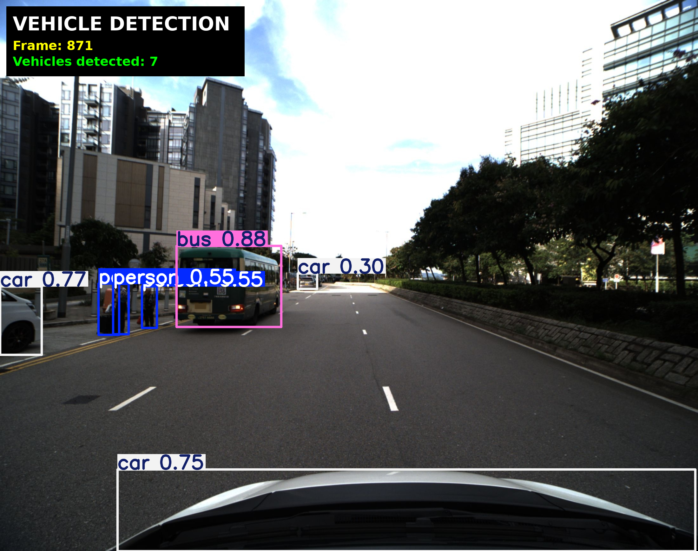
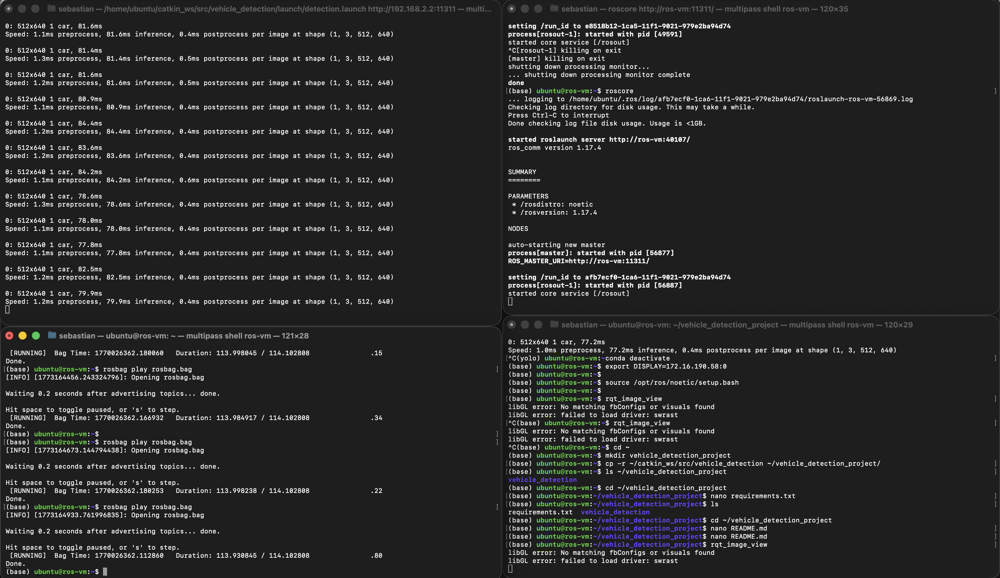

# AAE4011 Assignment 1 – Q3
## ROS-Based Vehicle Detection from Rosbag

Student: Sebastian Kissner - 25140182X
Module: AAE4011 – Fundamentals of Programming for AI  
Assignment: Assignment 1 – Question 3  

---

# 1. Overview

This project implements a ROS-based vehicle detection pipeline that processes camera images stored in a rosbag file.

The system reads camera images from a ROS topic, performs object detection using the YOLOv8 deep learning model, and publishes annotated images containing bounding boxes and statistics.

The results are visualised using the ROS GUI tool `rqt_image_view`.

Pipeline:

rosbag → camera topic → YOLO detection node → annotated image topic → GUI viewer

---

# 2. Detection Method (Q3.1)

For this project I used the Ultralytics YOLOv8 object detection model.

YOLO (You Only Look Once) is a single-stage object detection architecture that predicts bounding boxes and class probabilities in a single forward pass through the neural network. Compared with two-stage detectors such as Faster R-CNN, YOLO provides significantly faster inference while maintaining good detection accuracy.

I selected YOLOv8 for several reasons:

- YOLO is widely considered an industry standard for real-time object detection
- I have previously used YOLO for real-time detection tasks
- the model is lightweight and efficient and can perform near real-time inference
- it is pre-trained for common vehicle classes such as cars, trucks and buses
- the Ultralytics implementation integrates easily into Python-based ROS nodes

For this project the YOLOv8n (nano) model was used because it provides a good balance between detection accuracy and computational efficiency. Additionally, it's compatible to the provided software stack on macOS. 

---

# 3. Repository Structure

vehicle_detection_project/

vehicle_detection/  
├── launch  
│   └── detection.launch  

├── scripts  
│   └── vehicle_detection.py  

├── CMakeLists.txt  
└── package.xml  

images/  
├── detection_result.png  
└── ros_pipeline.png  

requirements.txt  
README.md

The `vehicle_detection.py` script implements the ROS node responsible for running the YOLO detection model.

---

# 4. Prerequisites

The project was developed and tested with the following setup.

Operating System  
Ubuntu 20.04 (running inside a Multipass VM)

ROS Version  
ROS Noetic

Python Environment  
Conda environment using Python 3.10

Required Python Packages

ultralytics  
opencv-python  
numpy  
pillow  

GUI Support  
XQuartz is used on macOS to forward GUI windows from the VM.

---

# 5. Running the System (Q3.1)

Step 1 – Build the ROS workspace

cd ~/catkin_ws  
catkin_make  
source devel/setup.bash  

---

Step 2 – Start ROS master

Terminal 1

roscore

---

Step 3 – Play the rosbag

Terminal 2

rosbag play rosbag.bag

---

Step 4 – Start the vehicle detection node

Terminal 3

conda activate yolo  
roslaunch vehicle_detection detection.launch

---

Step 5 – Open the GUI viewer

Terminal 4

rqt_image_view

Select topic:

/vehicle_detection/image

---

# 6. Sample Results

Example detection result:

The screenshot shows bounding boxes generated by the YOLOv8 model together with the statistics overlay displaying the frame number and the number of detected vehicles.

---

ROS pipeline running:

This screenshot shows the full system running with the ROS master, rosbag playback, the vehicle detection node, and the GUI visualisation.

---

# 7. Video Demonstration (Q3.2)

Video Link:  
https://youtu.be/fTZsSNVpkDc

The demonstration video shows:

- launching the ROS system
- rosbag playback
- YOLO detection running in the ROS node
- the GUI displaying annotated detections
- a short explanation of the detection pipeline

---

# 8. Reflection & Critical Analysis (Q3.3)

## What Did You Learn?

Through this project I learned how to integrate a deep learning model into a ROS perception pipeline. In particular, I gained experience working with ROS image topics, rosbag playback, and connecting machine learning models with robotics software.

I also learned how to manage separate Python environments when combining ROS with deep learning frameworks such as PyTorch.

Most importantly, I learned how powerful AI tools (such as ChatGPT) are for software development, particularly troubleshooting.

---

## How Did You Use AI Tools?

AI tools were used to assist with debugging and development tasks, including resolving ROS configuration issues, handling Python dependency conflicts, and integrating the YOLO model into a ROS node. The code and files were mostly written by ChatGPT first, and then manually checked & adjusted. AI was also used to check the language (spelling & grammar) of this readme file.

Although AI assistance helped accelerate development, manual debugging and testing were still required to ensure that the ROS nodes, Python environments, and GUI visualisation worked correctly together. Additionally, the success of the AI tools depends on the quality of the prompt.

---

## How Could Detection Accuracy Be Improved?

Detection accuracy could be improved by training the YOLO model on a custom dataset containing images captured from drone cameras. This would allow the model to better adapt to aerial viewpoints.

Another option would be to use a larger or newer YOLO model (for example YOLOv11m), which could improve accuracy at the cost of increased computational requirements.

---

## Real-World Deployment Challenges

Deploying this system on a real drone introduces several challenges.

First, real-time processing constraints may limit the complexity of the detection model because onboard computers typically have limited processing power.

Second, environmental factors such as lighting changes, motion blur, and occlusions could reduce detection accuracy in real-world scenarios.

---

# 9. References

Ultralytics YOLOv8 Documentation  
https://docs.ultralytics.com

ROS Noetic Documentation  
https://wiki.ros.org/noetic

Ultralytics GitHub Repository  
https://github.com/ultralytics/ultralytics
